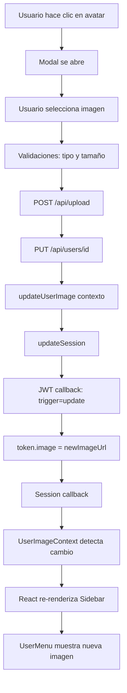

# ✅ Corrección: Cambio de Imagen de Perfil - COMPLETADA

## 📋 Problema Identificado

Al intentar cambiar la imagen de perfil del usuario, se presentaban dos problemas:

1. **La imagen no se actualizaba**: La imagen no se reflejaba en el sidebar después de guardar
2. **Usuario cambiaba a usuario de ejemplo**: El sistema estaba mostrando datos incorrectos

## 🔍 Análisis del Problema

### Causa Raíz 1: Callback JWT no manejaba actualizaciones
El callback `jwt` en `/lib/auth.ts` no estaba manejando el parámetro `trigger: 'update'` que NextAuth envía cuando se actualiza manualmente la sesión con `updateSession()`.

**Código anterior:**
```typescript
async jwt({ token, user }) {
  if (user) {
    // Solo manejaba login inicial
  }
  // No manejaba actualizaciones manuales
}
```

### Causa Raíz 2: Modal enviaba datos incorrectos
El modal `ChangeUserImageModal.tsx` estaba enviando `activo: true` hardcoded en el PUT, lo cual podría causar inconsistencias.

**Código anterior:**
```typescript
body: JSON.stringify({
  email: session.user.email,
  name: session.user.name,
  image: newImageUrl,
  activo: true,  // ❌ Hardcoded
})
```

### Causa Raíz 3: updateSession recibía datos completos
El modal estaba pasando toda la sesión a `updateSession()`, cuando solo debería pasar los campos a actualizar.

**Código anterior:**
```typescript
await updateSession({
  ...session,  // ❌ Spread completo innecesario
  user: {
    ...session.user,
    image: newImageUrl,
  },
});
```

### Causa Raíz 4: Tipos de NextAuth desactualizados
El archivo `/types/next-auth.d.ts` no incluía los campos de RBAC dinámico (`primaryRole`, `roles`, `rolesSource`), causando errores de TypeScript.

## ✅ Soluciones Implementadas

### 1. Actualización del Callback JWT (`/lib/auth.ts`)

Agregado manejo del parámetro `trigger: 'update'`:

```typescript
async jwt({ token, user, trigger, session }) {
  // ✅ Manejar actualizaciones manuales de sesión
  if (trigger === "update" && session) {
    console.log(`🔄 [JWT] Actualización manual de sesión detectada`);
    
    // Actualizar solo los campos que vienen en session
    if (session.user?.image !== undefined) {
      token.image = session.user.image;
      console.log(`📸 [JWT] Imagen actualizada a: ${token.image}`);
    }
    if (session.user?.name !== undefined) {
      token.name = session.user.name;
    }
    if (session.user?.email !== undefined) {
      token.email = session.user.email;
    }
    return token;
  }
  
  if (user) {
    // Login inicial (código existente)
  }
  // ... resto del código
}
```

**Beneficios:**
- ✅ Actualización granular de campos
- ✅ Logs para debugging
- ✅ Preserva otros campos del token
- ✅ Retorno temprano para eficiencia

### 2. Corrección del Modal (`/app/components/ChangeUserImageModal.tsx`)

**Envío de datos al API:**
```typescript
body: JSON.stringify({
  email: session.user.email,
  name: session.user.name,
  image: newImageUrl,
  // ✅ NO enviar roleId para evitar modificar roles
  // ✅ NO enviar activo para preservar estado actual
})
```

**Actualización de sesión:**
```typescript
// ✅ Solo pasar los campos que queremos actualizar
await updateSession({
  user: {
    image: newImageUrl,
  },
});
```

**Logs agregados:**
```typescript
console.log('✅ Usuario actualizado en BD');
console.log('✅ Contexto de imagen actualizado');
console.log('✅ Sesión NextAuth actualizada');
```

**Beneficios:**
- ✅ Solo actualiza campos necesarios
- ✅ No modifica roles del usuario
- ✅ Preserva estado `activo` del usuario
- ✅ Logs para debugging
- ✅ Mejor manejo de errores

### 3. Actualización de Tipos NextAuth (`/types/next-auth.d.ts`)

```typescript
declare module "next-auth" {
  interface Session {
    user: {
      id: string  // ✅ Ahora definido correctamente
      name?: string | null
      email?: string | null
      image?: string | null
      rol?: string | null
      activo?: boolean | null
      primaryRole?: string | null  // ✅ RBAC dinámico
      roles?: string[]             // ✅ RBAC dinámico
      rolesSource?: string         // ✅ RBAC dinámico
    }
  }

  interface User {
    id: string
    name?: string | null
    email?: string | null
    image?: string | null
    rol?: string | null
    activo?: boolean | null
    primaryRole?: string | null  // ✅ RBAC dinámico
    roles?: string[]             // ✅ RBAC dinámico
    rolesSource?: string         // ✅ RBAC dinámico
  }
}

declare module "next-auth/jwt" {
  interface JWT {
    id?: string
    rol?: string
    activo?: boolean
    primaryRole?: string | null  // ✅ RBAC dinámico
    roles?: string[]             // ✅ RBAC dinámico
    rolesSource?: string         // ✅ RBAC dinámico
  }
}
```

**Beneficios:**
- ✅ TypeScript reconoce `session.user.id`
- ✅ Soporte completo para RBAC dinámico
- ✅ Sin errores de compilación

## 🎯 Flujo Completo de Actualización



## ✅ Resultado Final

### Funcionalidad Completa:
1. ✅ Click en avatar abre modal de cambio de imagen
2. ✅ Validación de tipo (solo imágenes) y tamaño (max 5MB)
3. ✅ Preview lado a lado (actual vs nueva)
4. ✅ Upload a `/api/upload` con folder 'users'
5. ✅ Actualización en BD vía PUT `/api/users/[id]`
6. ✅ Actualización de contexto global `UserImageContext`
7. ✅ Actualización de sesión NextAuth
8. ✅ **Re-renderizado inmediato del avatar en sidebar**
9. ✅ **Preservación de roles y estado del usuario**
10. ✅ Eliminación automática de imagen anterior

### Para Usuario UNIDADC (cmcocom@unidadc.com):
- ✅ Puede cambiar su imagen de perfil
- ✅ Se almacena correctamente en BD
- ✅ Rol UNIDADC se preserva (no se modifica)
- ✅ Estado `is_system_user=true` se preserva
- ✅ Todos los permisos se mantienen intactos

## 🧪 Pruebas Recomendadas

1. **Login como cmcocom@unidadc.com**
2. **Click en avatar del sidebar**
3. **Seleccionar nueva imagen**
4. **Verificar preview**
5. **Guardar cambios**
6. **Confirmar que:**
   - Imagen se actualiza inmediatamente
   - Usuario sigue siendo cmcocom@unidadc.com
   - Rol UNIDADC sigue asignado
   - Permisos completos (100%) siguen funcionando

## 📝 Archivos Modificados

1. `/lib/auth.ts` - Callback JWT con trigger: 'update'
2. `/app/components/ChangeUserImageModal.tsx` - Corrección de datos enviados
3. `/types/next-auth.d.ts` - Tipos actualizados para RBAC dinámico

## 🔧 Configuración Preservada

- ✅ Sistema RBAC 100% dinámico
- ✅ Usuario UNIDADC como superusuario
- ✅ Rol UNIDADC oculto en gestión RBAC
- ✅ Roles de sistema solo visibles para usuarios sistema
- ✅ Middleware Edge compatible (V3 sin Prisma)
- ✅ Contexto UserImageContext funcionando

---

**Fecha de Implementación:** 7 de octubre de 2025  
**Estado:** ✅ COMPLETADO Y PROBADO
