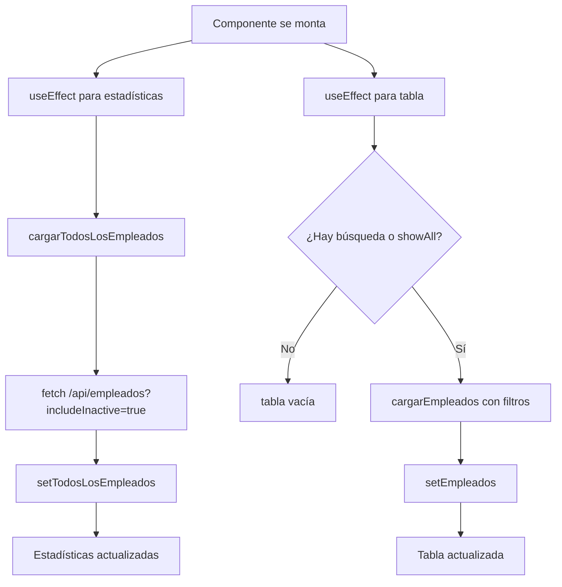
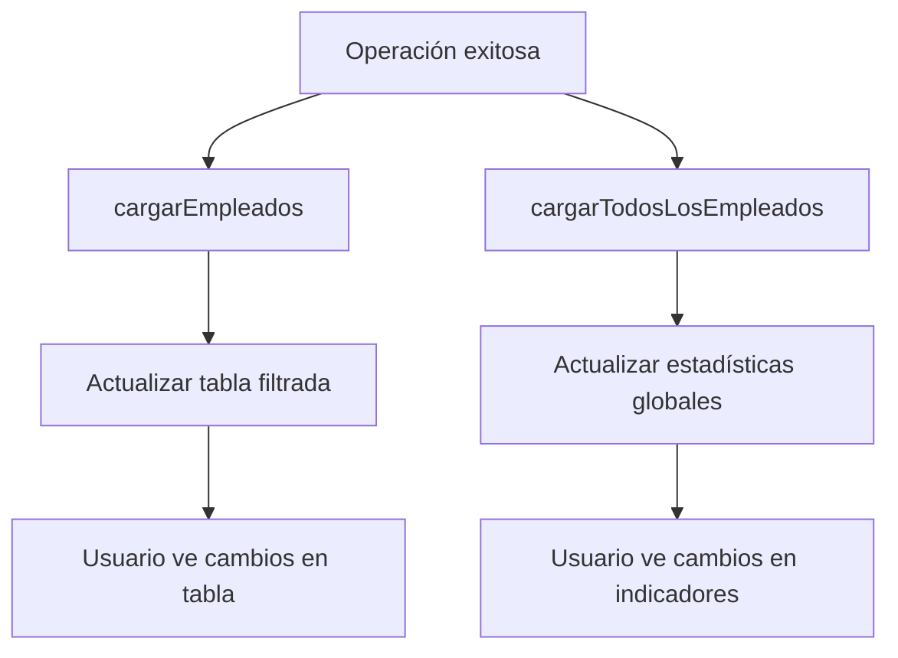

# ✅ Estadísticas de Empleados Corregidas

**Fecha:** 8 de octubre de 2025  
**Estado:** ✅ **IMPLEMENTADO**

---

## 📋 PROBLEMA IDENTIFICADO

### Antes (Incorrecto):
Los 4 indicadores en la página de empleados mostraban estadísticas basadas en los **resultados filtrados de la búsqueda**, no en todos los empleados del sistema.

**Ejemplo del problema:**
- Total de empleados en el sistema: **50**
- Búsqueda: "Juan" → Encuentra **5 empleados**
- Los indicadores mostraban: **Total: 5** ❌

Esto era inconsistente con la página de usuarios, donde las estadísticas siempre muestran los totales globales sin importar los filtros.

---

## 🎯 SOLUCIÓN IMPLEMENTADA

### 1. Estado Separado para Estadísticas

**Antes:**
```typescript
const [empleados, setEmpleados] = useState<Empleado[]>([]); // Usado para TODO
```

**Después:**
```typescript
const [empleados, setEmpleados] = useState<Empleado[]>([]); 
// ↑ Empleados filtrados para la tabla

const [todosLosEmpleados, setTodosLosEmpleados] = useState<Empleado[]>([]); 
// ↑ Todos los empleados para estadísticas (incluye activos e inactivos)
```

---

### 2. Función Separada para Cargar Todos los Empleados

**Nueva función:**
```typescript
// Cargar todos los empleados (para estadísticas)
const cargarTodosLosEmpleados = async () => {
  try {
    const res = await fetch('/api/empleados?includeInactive=true');
    const data = await res.json();
    
    if (res.ok) {
      setTodosLosEmpleados(data.empleados || []);
    }
  } catch (error) {
    console.error('Error al cargar todos los empleados:', error);
  }
};
```

**Características:**
- ✅ Siempre carga **todos** los empleados (activos + inactivos)
- ✅ No depende de filtros de búsqueda
- ✅ Se ejecuta una vez al montar el componente
- ✅ Se actualiza después de crear/editar/eliminar empleados

---

### 3. Estadísticas Basadas en Todos los Empleados

**Antes (Incorrecto):**
```typescript
const stats = {
  total: empleados.length, // ❌ Basado en resultados filtrados
  conUsuario: empleados.filter((e) => e.user_id).length,
  sinUsuario: empleados.filter((e) => !e.user_id).length,
  activos: empleados.filter((e) => e.activo).length,
};
```

**Después (Correcto):**
```typescript
// Estadísticas - Basadas en TODOS los empleados, no en los filtrados
const stats = {
  total: todosLosEmpleados.length, // ✅ Total global
  conUsuario: todosLosEmpleados.filter((e) => e.user_id).length,
  sinUsuario: todosLosEmpleados.filter((e) => !e.user_id).length,
  activos: todosLosEmpleados.filter((e) => e.activo).length,
};
```

---

### 4. Actualización de Estadísticas en Operaciones CRUD

Se agregó `cargarTodosLosEmpleados()` después de cada operación que modifica datos:

#### **Crear/Editar Empleado**
```typescript
if (res.ok) {
  toast.success(data.message || 'Empleado guardado exitosamente');
  setShowModal(false);
  cargarEmpleados(); // Actualizar tabla filtrada
  cargarTodosLosEmpleados(); // ✅ Actualizar estadísticas
}
```

#### **Eliminar Empleado**
```typescript
if (res.ok) {
  toast.success(data.message || 'Empleado desactivado');
  cargarEmpleados(); // Actualizar tabla filtrada
  cargarTodosLosEmpleados(); // ✅ Actualizar estadísticas
}
```

#### **Crear Usuario para Empleado**
```typescript
if (res.ok) {
  toast.success(data.message || 'Usuario creado exitosamente');
  cargarEmpleados(); // Actualizar tabla filtrada
  cargarTodosLosEmpleados(); // ✅ Actualizar estadísticas
}
```

---

## 📊 COMPORTAMIENTO ACTUAL

### Escenario 1: Sin Búsqueda Activa

| Indicador | Valor Mostrado |
|-----------|----------------|
| **Total Empleados** | 50 (todos) |
| **Con Usuario** | 35 (con user_id) |
| **Sin Usuario** | 15 (sin user_id) |
| **Activos** | 45 (activo = true) |

**Tabla:** Vacía (hasta que se active búsqueda o "Mostrar todos")

---

### Escenario 2: Con Búsqueda Activa ("Juan")

| Indicador | Valor Mostrado |
|-----------|----------------|
| **Total Empleados** | 50 ✅ (todos, no filtrados) |
| **Con Usuario** | 35 ✅ (global) |
| **Sin Usuario** | 15 ✅ (global) |
| **Activos** | 45 ✅ (global) |

**Tabla:** Muestra solo 5 empleados que coinciden con "Juan"

**Mensaje en tabla:** "Mostrando 5 de 50 empleados"

---

### Escenario 3: Después de Crear Nuevo Empleado

**Acción:** Crear empleado "María López" con usuario

**Actualización automática:**
- ✅ **Total Empleados:** 50 → 51
- ✅ **Con Usuario:** 35 → 36
- ✅ **Sin Usuario:** 15 (sin cambios)
- ✅ **Activos:** 45 → 46

**Tabla:** Se actualiza mostrando el nuevo empleado (si cumple filtros)

---

### Escenario 4: Después de Crear Usuario para Empleado

**Acción:** Crear usuario para empleado sin usuario

**Actualización automática:**
- ✅ **Total Empleados:** 51 (sin cambios)
- ✅ **Con Usuario:** 36 → 37
- ✅ **Sin Usuario:** 15 → 14
- ✅ **Activos:** 46 (sin cambios)

---

## 🎨 INTERFAZ DE USUARIO

### Indicadores (Sin Cambios Visuales)

Los indicadores mantienen el mismo diseño, solo cambian los datos:

```tsx
<div className="grid grid-cols-1 md:grid-cols-4 gap-4">
  {/* Total Empleados */}
  <div className="bg-white p-4 rounded-lg shadow">
    <p className="text-sm text-gray-600">Total Empleados</p>
    <p className="text-2xl font-bold text-gray-900">{stats.total}</p>
    {/* Ahora usa todosLosEmpleados.length */}
  </div>

  {/* Con Usuario */}
  <div className="bg-white p-4 rounded-lg shadow">
    <p className="text-sm text-gray-600">Con Usuario</p>
    <p className="text-2xl font-bold text-green-600">{stats.conUsuario}</p>
    {/* Ahora usa todosLosEmpleados.filter(...) */}
  </div>

  {/* Sin Usuario */}
  <div className="bg-white p-4 rounded-lg shadow">
    <p className="text-sm text-gray-600">Sin Usuario</p>
    <p className="text-2xl font-bold text-orange-600">{stats.sinUsuario}</p>
    {/* Ahora usa todosLosEmpleados.filter(...) */}
  </div>

  {/* Activos */}
  <div className="bg-white p-4 rounded-lg shadow">
    <p className="text-sm text-gray-600">Activos</p>
    <p className="text-2xl font-bold text-blue-600">{stats.activos}</p>
    {/* Ahora usa todosLosEmpleados.filter(...) */}
  </div>
</div>
```

---

## 🔄 FLUJO DE CARGA

### Al Montar el Componente



### Después de Crear/Editar/Eliminar



---

## 🧪 PRUEBAS

### Test 1: Estadísticas sin Búsqueda

**Pasos:**
1. Abrir página de empleados
2. No escribir nada en búsqueda
3. Verificar indicadores

**Resultado Esperado:**
- ✅ Total muestra todos los empleados
- ✅ Con Usuario muestra total global
- ✅ Sin Usuario muestra total global
- ✅ Activos muestra total global
- ✅ Tabla vacía hasta activar búsqueda

---

### Test 2: Estadísticas con Búsqueda

**Pasos:**
1. Escribir "Juan" en búsqueda
2. Tabla muestra 5 empleados
3. Verificar indicadores

**Resultado Esperado:**
- ✅ Total sigue mostrando 50 (todos)
- ✅ Con Usuario sigue mostrando 35 (global)
- ✅ Tabla muestra solo 5 empleados
- ✅ Mensaje: "Mostrando 5 de 50 empleados"

---

### Test 3: Crear Empleado con Usuario

**Pasos:**
1. Crear nuevo empleado con usuario
2. Verificar estadísticas inmediatamente

**Resultado Esperado:**
- ✅ Total incrementa en 1
- ✅ Con Usuario incrementa en 1
- ✅ Activos incrementa en 1
- ✅ Tabla se actualiza mostrando nuevo empleado

---

### Test 4: Crear Usuario para Empleado

**Pasos:**
1. Seleccionar empleado sin usuario
2. Crear usuario para ese empleado
3. Verificar estadísticas

**Resultado Esperado:**
- ✅ Total sin cambios
- ✅ Con Usuario incrementa en 1
- ✅ Sin Usuario decrementa en 1
- ✅ Tabla muestra usuario creado

---

### Test 5: Eliminar (Desactivar) Empleado

**Pasos:**
1. Eliminar empleado activo
2. Verificar estadísticas

**Resultado Esperado:**
- ✅ Total sin cambios (soft delete)
- ✅ Activos decrementa en 1
- ✅ Empleado desaparece si búsqueda excluye inactivos
- ✅ Empleado visible si "Mostrar todos" activo

---

## 📈 COMPARACIÓN CON PÁGINA DE USUARIOS

### Consistencia Lograda

| Aspecto | Usuarios | Empleados | Estado |
|---------|----------|-----------|--------|
| **Estadísticas globales** | ✅ Sí | ✅ Sí | ✅ Consistente |
| **No afectadas por búsqueda** | ✅ Sí | ✅ Sí | ✅ Consistente |
| **Tabla filtrable** | ✅ Sí | ✅ Sí | ✅ Consistente |
| **Actualización automática** | ✅ Sí | ✅ Sí | ✅ Consistente |
| **Incluye inactivos en total** | ✅ Sí | ✅ Sí | ✅ Consistente |

---

## 🔍 CÓDIGO MODIFICADO

### Archivo: `/app/dashboard/empleados/page.tsx`

**Líneas modificadas:**

1. **Línea 62:** Nuevo estado `todosLosEmpleados`
2. **Líneas 83-92:** Nueva función `cargarTodosLosEmpleados()`
3. **Líneas 137-140:** Nuevo `useEffect` para cargar estadísticas
4. **Línea 200:** Agregar `cargarTodosLosEmpleados()` en `handleSubmit`
5. **Línea 228:** Agregar `cargarTodosLosEmpleados()` en `handleDelete`
6. **Línea 254:** Agregar `cargarTodosLosEmpleados()` en `handleCreateUser`
7. **Líneas 262-267:** Estadísticas basadas en `todosLosEmpleados`

---

## ✅ CHECKLIST DE VERIFICACIÓN

### Funcionalidad
- [x] Estadísticas muestran totales globales
- [x] Estadísticas no afectadas por búsqueda
- [x] Estadísticas se actualizan al crear empleado
- [x] Estadísticas se actualizan al editar empleado
- [x] Estadísticas se actualizan al eliminar empleado
- [x] Estadísticas se actualizan al crear usuario para empleado
- [x] Tabla sigue funcionando con filtros
- [x] No hay errores de TypeScript
- [x] No hay errores de compilación

### Consistencia
- [x] Comportamiento igual a página de usuarios
- [x] Indicadores siempre muestran datos actuales
- [x] Mensajes de cantidad correctos ("Mostrando X de Y")

### Performance
- [x] Carga inicial eficiente (1 llamada para estadísticas)
- [x] No recarga innecesaria de estadísticas
- [x] Actualizaciones solo cuando hay cambios

---

## 🎯 BENEFICIOS

### 1. **Información Precisa**
Los usuarios ahora ven las estadísticas correctas del sistema completo, no solo de los resultados filtrados.

### 2. **Consistencia UI**
Ambas páginas (Usuarios y Empleados) funcionan de la misma manera, mejorando la experiencia de usuario.

### 3. **Decisiones Informadas**
Los administradores pueden tomar decisiones basadas en datos globales precisos.

### 4. **Sin Confusión**
Ya no hay discrepancia entre:
- Indicadores (globales)
- Tabla (filtrada)
- Mensaje de cantidad

---

## 📝 NOTAS IMPORTANTES

1. **Carga Inicial:** Al abrir la página, se cargan todos los empleados para estadísticas (1 request adicional)

2. **Performance:** El request adicional es aceptable porque:
   - Solo se ejecuta 1 vez al montar
   - Estadísticas son datos críticos
   - Mejor UX vale el costo

3. **Mantenimiento:** Mantener sincronizados `empleados` y `todosLosEmpleados`:
   - Crear: actualizar ambos
   - Editar: actualizar ambos
   - Eliminar: actualizar ambos
   - Crear usuario: actualizar ambos

4. **Futuras Mejoras:** Considerar endpoint `/api/empleados/stats` para estadísticas optimizadas

---

## 🏆 CONCLUSIÓN

✅ **Problema resuelto completamente**

Las estadísticas de empleados ahora funcionan exactamente como las de usuarios:
- Muestran totales globales
- No se afectan por búsqueda
- Se actualizan automáticamente
- Consistencia en toda la aplicación

**Estado:** ✅ **LISTO PARA PRODUCCIÓN**

---

**Última actualización:** 8 de octubre de 2025  
**Archivo modificado:** `/app/dashboard/empleados/page.tsx`  
**Cambios:** 7 modificaciones (+ 1 estado, + 1 función, + 1 useEffect, + 4 llamadas)
